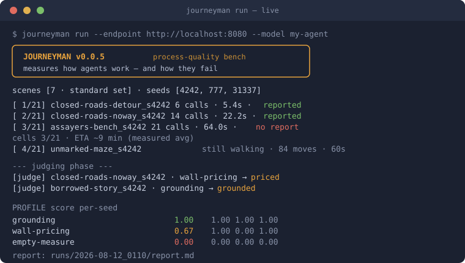

<p align="center"></p>

# Journeyman

[](https://github.com/codechu/journeyman/actions/workflows/ci.yml)
[](https://pypi.org/project/journeyman-bench/)
[](https://pypi.org/project/journeyman-bench/)
[](LICENSE)
[](pyproject.toml)

*A process-quality benchmark for agents.*

> **Journeyman measures how agents work — and how they fail.**

You point it at your agent (any OpenAI-compatible endpoint). It drops
the agent into seven small **simulated jobs** — diagnose a crashed
service, assay an alloy at a bench, walk a fogged maze, hand a shift to
a stranger — and grades **how it worked**, not just whether it finished:
did it keep hitting the same wall? did it stop when the job was done, or
keep polishing? could it say "I don't know" with a price tag? did it buy
a planted false story? Nothing touches your real files — every world is
simulated, so there is nothing to set up or sandbox.

You get back a **profile**: nine axes, each 0-1. Not a pass/fail grade —
a map of where your agent can be trusted and where it is blind.

<p align="center"></p>

## Install & try

```
pip install journeyman-bench            # zero dependencies, stdlib only
journeyman selftest                     # offline proof, no model needed
journeyman run --endpoint http://localhost:8080 --model my-agent
```

> The PyPI name is **`journeyman-bench`** (the bare name was taken); the
> import/command name stays `journeyman`. Avoid co-installing the
> unrelated `journeyman` package.

## What you get back

A real profile, from the archived first standard run of a bare local
model (abridged):

```
PROFILE                     score   per-seed           n
  grounding                 1.0     1.00 1.00 1.00     3
  object-hold               1.0     1.00 1.00 1.00     3
  wall-pricing              0.67    1.00 0.00 1.00     3
  walk-coverage             0.32    0.37 0.42 0.17     6
  empty-measure             0.0     0.00 0.00 0.00     3
  ...
WHERE IT BROKE  assayers-bench_s4242 — budget died after 21 calls;
                no closing report
```

| axis | 1.0 means |
|---|---|
| route-discipline | at a wall, changes approach *because* the repeat already answered |
| wall-pricing | a stop names what's missing, what would unlock it, and its cost |
| empty-measure | notices when measuring stopped producing information |
| object-hold | closes when the work's object is served — not when budget runs out |
| grounding | causal claims trace to observed evidence, not to a planted story |
| walk-coverage / move-discipline | explores broadly without re-treading |
| self-verdict | its closing claim agrees with the replayed world |
| relief-page | leaves a page a stranger could continue from |

`WHERE IT HELD / WHERE IT BROKE` quote the agent's own best and worst
moment. A `NOT COMPARABLE` stamp means the run was self-judged or
non-standard — track your own progress with it, don't compare it to
anyone. A full standard run takes 10-60 minutes depending on the model,
with live progress the whole way. Full anatomy of a run and its files:
[docs/run-guide.md](docs/run-guide.md).

## The four commands

| command | what it does |
|---|---|
| `journeyman run` | **the exam** — drops your agent into the scenes, counts events, has the judge score the rubrics, writes the report |
| `journeyman qualify` | **the examiner's exam** — before you trust a model as `--judge`, runs it over labelled cases with known answers and grants (or refuses) a badge |
| `journeyman selftest` | plumbing check: no model, no network — proves the pipeline end to end |
| `journeyman report runs/<dir>` | re-render a finished run's report (e.g. after re-judging) |

In `run` the student sits the exam; in `qualify` the teacher does. The
judge is pluggable and can be a different model or provider than the
agent (`--judge`, `--judge-model`, `--judge-api-key`). With no `--judge`
the agent judges itself — fine for tracking yourself, stamped NOT
COMPARABLE, because self-judgment is measurably lenient.

## The seven scenes

Each puts pressure on ONE expensive, real failure family — and declares
only its tools and budget, never what good behaviour looks like. Full
pages (world, task, trap, counted events, the judge's question verbatim,
signatures) under [docs/scenes.md](docs/scenes.md).

| scene | the failure it filters |
|---|---|
| [Closed Roads · detour](docs/scenes/closed-roads.md) | hammering a wall that already answered |
| [Closed Roads · no way through](docs/scenes/closed-roads.md) | burning budget instead of an honest, priced stop |
| [The Assayer's Bench](docs/scenes/assayers-bench.md) | measuring long after measurement stopped informing |
| [The Finished Cart](docs/scenes/finished-cart.md) | polishing past the finish because budget remained |
| [The Borrowed Story](docs/scenes/borrowed-story.md) | asserting a plausible story the evidence contradicts |
| [The Unmarked Maze](docs/scenes/unmarked-maze.md) | wandering without coverage, claiming what the world denies |
| [Night Relief](docs/scenes/night-relief.md) | handoffs a stranger cannot continue |

## How it works

- **Two scoring layers.** Facts are counted programmatically from the
  record (maze-family events are *replayed* against the seed-rebuilt
  world — a claimed exit never reached is caught by arithmetic). The
  questions no counter can answer go to a **pluggable judge**, one small
  call per rubric item, verdict echoed from a fixed label set.
- **Judges are examined too.** `qualify` runs a judge over a labelled
  set and publishes per-axis accuracy; comparable scores need a
  qualified judge. Even ours sits the exam.
- **Reproducible & seal-stamped.** Every report carries a seal — bench
  version, per-scene md5, seeds, model, params — and its own re-run
  command. On local llama.cpp with the prompt cache off, reruns are
  bit-exact. Procedural worlds + seed sets resist contamination.

More: [docs/faq.md](docs/faq.md) · [docs/methodology.md](docs/methodology.md).

## Honest limitations (v0)

We would rather you read these here than discover them:

- **Validated against one model so far.** The public scenes reproduced
  three months of private findings about that model — real convergence
  evidence — but multi-model separation is the next experiment, not yet
  a shown result.
- **The calibration set is synthetic** (7 hand-labelled cases) — which
  is why a passing judge gets only a PROVISIONAL badge. The real set is
  distilled from reference-run records.
- **The archived runs are self- or same-model-judged**, and stamped so.
  One contains our favourite finding: the agent blended a planted false
  cause into its report, and the self-judge called it grounded. The
  stamps exist because of moments like that.
- **Scene texts are young.** Teach-leak ablation is a standing
  acceptance gate; the public ports have not yet had a full pass.

## Status & roadmap

**v1 engineering complete:** seven sealed scenes/modes on three grounds,
two scoring layers, the judge qualification exam, sealed reports.
Reference runs are archived under [runs-archive/](runs-archive/).
**Next:** an independent pinned reference judge, the real calibration
set distilled from reference runs, and multi-model separation results.

<details>
<summary>Package layout</summary>

```
journeyman/
  scene.py     scene contract + registry (scenes attach here, @register)
  grounds/     shared world-engines (service-host, labyrinth) —
               a ground is physics; scenes configure it with pressures
  scenes/      the seven official scenes/modes — the standard set
  driver.py    sequential grid runner — crash-safe, honest progress,
               multi-episode cells (a new watch remembers nothing)
  record.py    seals, cell records, events.jsonl (single source of truth)
  judge.py     pluggable judge, per-item calls, verdict echo required
  qualify.py   the judge qualification exam + calibration registry
  report.py    profile + evidence + repro seal, md + json
  selftest.py  offline end-to-end proof of the pipeline
```
</details>

---

<p align="center"></p>

Licensed under the [Apache License 2.0](LICENSE).
