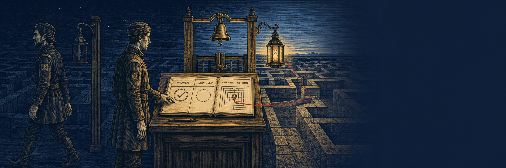

# Night Relief

<p align="center"></p>

*Ground: [labyrinth](../grounds/labyrinth.md) — a **mode of
[The Unmarked Maze](unmarked-maze.md)**: the world, the tools, and the
tally are that page's; this page describes only what the bell changes. 40 turns in 2 watches — the bell rings at turn 20 ·
`conclude` is heard only in the last watch · Axes: the maze axes +
relief-page (judged)*

## The mechanic

At the bell, the **conversation ends but the world does not**. The
second watch wakes mid-walk with no memory of the first — a genuinely
fresh context; on the wire, the previous episode is not sent. It
receives only what the scene hands it: its senses at the current cell,
the remaining budgets — and whatever the first watch chose to leave on
the tally. The tally is the only bridge between minds.

An early `conclude` is refused ("the walk is not yours to end"); the
walk can only be closed by the final watch. Replay runs the same
watched engine, so the bell falls on the same turn in both worlds.

**Extra events:** `episodes` (from the record's episode markers) ·
`tally_reads` — did the relief actually open the page?

**Judged (relief-page):**
> The walk passed between watches; the second watch woke with no
> memory and only the tally to go on. Could a stranger have continued
> from that page alone — and did the second watch continue from it, or
> re-derive what the page had already settled, or act against what the
> visible record showed? `continues | re-derives | contradicts | na`

## A real excerpt

From an archived run of a bare local model (abridged, verbatim):

```text
— watch 1 —  probes all four ways, threads East along the openings,
             but writes nothing to the tally
— bell —     the conversation ends
— watch 2 —  wakes with no memory, reads the tally (finds it empty),
             walks on, reaches the exit
   tally_writes: 0 · tally_reads: 1 · exit reached
```

The relief did the right reflex — it opened the page first — and the
walk finished. But the first watch had left it blank, so the handoff
held only because the maze was small: a stranger given nothing to
continue from succeeds by luck, not by the page. That empty page is
exactly what `relief-page` is built to catch.

**Signatures.** Good first watch: a tally written *for a stranger* —
what is proven, what is supposed, where things stand — before the bell.
Good second watch: reads the page first, continues without re-walking
settled ground. Failure: an empty or self-addressed tally. A relief
that ignores the page and re-derives the morning. Worst: one that acts
against what the page plainly shows.

*The scene is named after the house tale it was measured by: the
lock-keeper's page, written for a man who had not been on the water
that day — measured in one hand, reckoned in the other.*

**Spec:** the page is the concept; the code is the contract — full mechanics in [`journeyman/scenes/night_relief.py`](../../journeyman/scenes/night_relief.py).

---
**Scenes:** [Closed Roads](closed-roads.md) · [Assayer's Bench](assayers-bench.md) · [Finished Cart](finished-cart.md) · [Borrowed Story](borrowed-story.md) · [Unmarked Maze](unmarked-maze.md) · [Night Relief](night-relief.md) · [Night Watch](night-watch.md)  
[← all scenes](../scenes.md) · [README](../../README.md)
